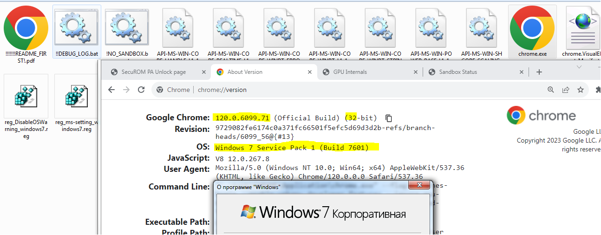

# Google Chrome crack - Windows 7 
## 120.0.6099.217_x64/x86
 Prevision: 120.0.6099.71_x64/x86, 117.0.5938.63/89_x64_x86, 114.0.5735.134 x64 , 114.0.5735.199 x86  
`--no-sandbox`**is no longer needed!** Print preview (`Ctrl + P/ Ctrl + Shift + P`) is also fixed, but but assuming that may is corrupt at some time (please, report this situation).

 
* see *!!!!!!!README_FIRST!.pdf*
  

## Intro  
Dirty corporations and Hindu-managers are trying to deprive the any users of all the benefits that were created by technically more advanced people than them. Windows 7 and Windows XP are the most successful and best technical creations of Microsoft ever.  

## Chromium based projects
🇪 [Microsoft EDGE 120.0.2210.77](https://github.com/Blaukovitch/Microsoft-EDGE-Windows-7-CRACK) git branch  (or see RELEASES here)   
🅾️ [Opera 102.0.4880.70](https://github.com/Blaukovitch/GOOGLE_CHROME_Windows_7_CRACK/releases/tag/Opera_EARLY/) browser   
🟢 [Spotify 1.2.22.982](https://github.com/Blaukovitch/GOOGLE_CHROME_Windows_7_CRACK/releases/tag/Spotify_first) music
  
## How it's work?  
1) **Binary bithack (patch the assembly code):**  
* chrome.exe  
* *{ver.}*/chrome_elf.dll  
* *{ver.}*/chrome.dll  

2) **WinAPI LIFTING - Missing WINAPIs are deployed:**  
* API-MS-WIN-SHCORE-SCALING-L1-1-1  
* API-MS-WIN-POWER-BASE-L1-1-0  
* API-MS-WIN-CORE-WINRT-STRING-L1-1-0  
* API-MS-WIN-CORE-WINRT-L1-1-0  
* API-MS-WIN-CORE-WINRT-ERROR-L1-1-0
* API-MS-WIN-CORE-REALTIME-L1-1-1
* API-MS-WIN-CORE-LIBRARYLOADER-L1-2-0
* API-MS-WIN-CORE-HANDLE-L1-1-0
3) **Bridged DLL (wrappers):** 
* kernel64.dll
* user64.dll
* userenx.dll
* xcryptprimitives.dll
* Xfplat.dll
* WinXttp.dll
* netapi64.dll  
https://github.com/Blaukovitch/API-MS-WIN_XP 

⚠️ <u>WARNING:</u> Files not signed! I don't have a Google Inc. private key at the moment.

## How to install?
1) Download from release the merged pack; 
2) (for prevision **114 only**) Check you Microsoft Visual C++ Redistributable 2015-2019: https://learn.microsoft.com/en-US/cpp/windows/latest-supported-vc-redist?view=msvc-170 or 2015: https://www.microsoft.com/en-us/download/details.aspx?id=52685

## WOW! WebGPU on Windows 7
May be unstable!  
Add to command line (with *--no-sandbox*) webgpu flag and **DirectX 3D 11** as webgpu render:  
`--enable-unsafe-webgpu --use-webgpu-adapter=d3d11`  
In launched Chrome 114 must set enabled those flags:  
`chrome://flags/#enable-webgpu-developer-features`  
`chrome://flags/#ignore-gpu-blocklist`  
and restart again.  

## Features table
| Critical | State |
| ------ | ------ |
| Stable | ✔️ |
| WinAPI lifting | approx. **95%** |
| Sandbox support (gpu) | ✔️ | 
| DirectX Write render | ✔️ | 
| DXVAVDA | ✔️ | 
| WebGL1/2 | ✔️ | 
| WebGPU / DirectX 11 (gpu)| ❓ | 

## YOUTUBE
https://www.youtube.com/watch?v=idzQV2wNUAI

**ELF (author of 80_PA SecuROM keygen), cracklab/exelab team, 2023**  
https://cracklab.team/index.php?threads/1037/
