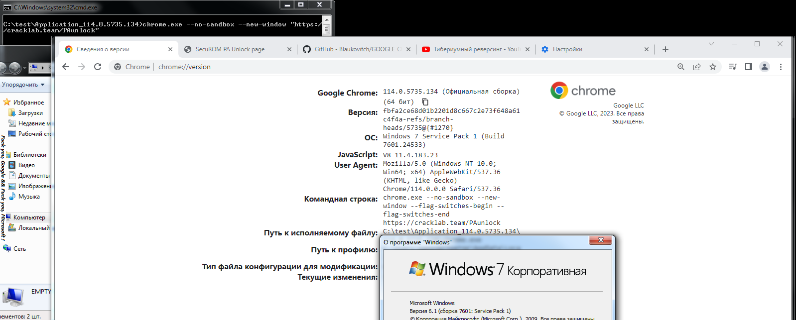
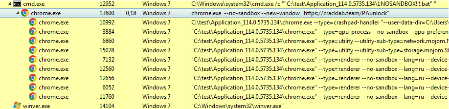

# Google Chrome crack - Windows 7  
## 114.0.5735.134 x64  
## 114.0.5735.199 x86  
*Run from command line or .BAT/.LNK file:*  
`chrome.exe --no-sandbox`*  

* **Yes, yes**, in this very first version (*114.0.5735.134*) **only by disabling the sandbox** - otherwise the browser will not start! **Yes**, it can be fixed - but it will take more time for a quality fix. **Yes**, perhaps hardware acceleration of **DirectX 11** after fixing the sandbox will also work perfrectly on the Windows 7.  
  
  

## Intro  
Dirty corporations and Hindu-managers are trying to deprive the any users of all the benefits that were created by technically more advanced people than them. Windows 7 and Windows XP are the most successful and best technical creations of Microsoft ever.  
  
## How it's work?  
1) **Binary bithack (patch the assembly code):**  
* chrome.exe  
* *{ver.}*/chrome_elf.dll  
* *{ver.}*/chrome.dll  

2) **WinAPI LIFTING - Missing WINAPIs are deployed:**  
* API-MS-WIN-SHCORE-SCALING-L1-1-1  
* API-MS-WIN-POWER-BASE-L1-1-0  
* API-MS-WIN-CORE-WINRT-STRING-L1-1-0  
* API-MS-WIN-CORE-WINRT-L1-1-0  
* API-MS-WIN-CORE-WINRT-ERROR-L1-1-0  
* msvproc  
https://github.com/Blaukovitch/API-MS-WIN_XP 

⚠️ <u>WARNING:</u> Files not signed! I don't have a Google Inc. private key at the moment.

## How to install?
1) Download from release the merged pack;
2) Check you Microsoft Visual C++ Redistributable 2015-2019: https://learn.microsoft.com/en-US/cpp/windows/latest-supported-vc-redist?view=msvc-170 or 2015: https://www.microsoft.com/en-us/download/details.aspx?id=52685

## WOW! WebGPU on Windows 7 
May be unstable!  
Add to command line (with *--no-sandbox*) webgpu flag and **DirectX 3D 11** as webgpu render:  
`--enable-unsafe-webgpu --use-webgpu-adapter=d3d11`  
In launched Chrome 114 must set enabled those flags:  
`chrome://flags/#enable-webgpu-developer-features`  
`chrome://flags/#ignore-gpu-blocklist`  
and restart again.  

## Features table
| Critical | State |
| ------ | ------ |
| Stable | ✔️ |
| WinAPI lifting | approx. **90%** |
| Sandbox support (gpu) | ❌ | 
| DirectX Write render | ✔️ | 
| DXVAVDA | ✔️ | 
| WebGL1/2 | ✔️ | 
| WebGPU / DirectX 11 (gpu)| ❓ | 

**ELF (author of 80_PA SecuROM keygen), cracklab/exelab team, 2023**  
https://cracklab.team/index.php?threads/1037/
